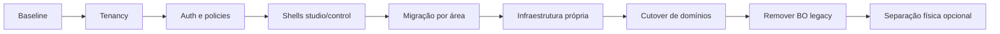

# WebCatalogue — plano faseado de extração do backoffice

Data: 2026-07-25

Estado: **Proposta para aprovação**

## Objetivo

Destacar completamente o WebCatalogue do BO agregador sem interromper a operação atual, terminando com:

```text
ar-webcatalogue.com             Frontoffice institucional
studio.ar-webcatalogue.com      BO dos clientes
control.ar-webcatalogue.com     BO administrativo interno
api.ar-webcatalogue.com         Documentação e API
{store}.ar-webcatalogue.com     Catálogo público
```

## Estratégia

Usar uma migração incremental do tipo strangler:

1. manter temporariamente o BO atual;
2. criar as novas superfícies em paralelo;
3. migrar uma área funcional de cada vez;
4. comparar resultados e manter rollback;
5. bloquear alterações no BO antigo;
6. remover as rotas antigas apenas após estabilização.

Não começar por separar fisicamente o repositório. Primeiro criar limites claros dentro da aplicação atual; depois do cutover, o WebCatalogue pode ser movido para aplicação/repositório próprio com risco muito menor.

## Regras de execução

- nenhuma fase avança sem cumprir o respetivo critério de saída;
- migrations devem ser compatíveis com rollback ou forward-fix documentado;
- durante coexistência, existe uma única origem de verdade;
- não manter dois caminhos de escrita concorrentes sem controlo;
- todas as novas funcionalidades são construídas diretamente na arquitetura autónoma;
- feature flags controlam exposição, escrita e cutover;
- logs identificam origem: `legacy_bo`, `studio`, `control`, `api` ou `public`;
- qualquer acesso cross-tenant é auditado.

## Feature flags propostas

```text
WEBCATALOGUE_STUDIO_ENABLED
WEBCATALOGUE_CONTROL_ENABLED
WEBCATALOGUE_TENANCY_ENFORCEMENT
WEBCATALOGUE_LEGACY_BO_READ_ONLY
WEBCATALOGUE_LEGACY_BO_ENABLED
WEBCATALOGUE_HOST_ROUTING_ENABLED
WEBCATALOGUE_API_V1_ENABLED
```

As flags devem ter valores por ambiente e não podem ser alteradas por utilizadores sem autorização administrativa.

## Fase 0 — baseline e proteção

### Trabalho

- congelar baseline funcional;
- garantir suite automática verde;
- guardar inventário de rotas, configurações e tabelas;
- backup da base de dados e storage;
- preparar dados de demonstração;
- remover endpoint temporário MTG;
- documentar rollback operacional.

### Critério de saída

- testes verdes;
- backup e restore validados;
- working tree limpo;
- nenhuma rota temporária pública;
- baseline identificada por commit/tag.

### Rollback

Não aplicável: ainda não existe mudança de arquitetura.

## Fase 1 — fundação multi-tenant

### Trabalho

- criar organizações;
- criar memberships de organização e store;
- adicionar `id_organization` às stores;
- criar `TenantContext`;
- criar resolução de tenant para sessão, hostname, API e jobs;
- migrar stores atuais para `Legacy WebCatalogue`;
- executar auditoria de `id_store` nulos ou inválidos;
- adicionar policies em modo de observação.

### Coexistência

O BO antigo continua operacional. O enforcement inicia em modo de auditoria, registando violações sem bloquear.

### Critério de saída

- dados atuais associados a organização;
- testes de isolamento verdes;
- zero ownership órfão;
- logs de auditoria sem violações não explicadas.

### Rollback

- desativar `WEBCATALOGUE_TENANCY_ENFORCEMENT`;
- manter colunas/tabelas novas sem as apagar;
- continuar a usar `id_store` como antes.

## Fase 2 — autenticação e autorização autónomas

### Trabalho

- implementar login, convite, recuperação e verificação de email;
- criar roles e policies aprovadas;
- sessões separadas para `studio` e `control`;
- MFA obrigatório no `control`;
- credenciais API por store;
- auditoria de logins, memberships e ações críticas.

### Coexistência

Utilizadores piloto podem aceder ao `studio`; restantes continuam no BO antigo.

### Critério de saída

- fluxos de auth testados;
- matriz de permissões coberta por testes;
- cookies não cruzam subdomínios;
- MFA e revogação de sessão validados.

### Rollback

- desativar `studio`/`control`;
- manter autenticação antiga;
- não eliminar utilizadores ou mappings durante o piloto.

## Fase 3 — shells studio e control

### Trabalho

- criar layouts e navegação próprios;
- criar controllers base próprios;
- substituir actions, breadcrumbs e page titles globais;
- criar seletor de organização/store;
- criar dashboard inicial;
- separar visualmente o modo de suporte/administração.

### Coexistência

As shells começam com funcionalidades de consulta. Links de escrita apontam temporariamente para o BO antigo quando necessário.

### Critério de saída

- shells funcionam sem `layouts.app`;
- controllers não dependem do controller global;
- navegação respeita roles;
- responsividade e acessibilidade base validadas.

### Rollback

- desligar as flags das shells;
- manter links e rotas legacy.

## Fase 4 — migração funcional para o studio

Migrar na seguinte ordem:

1. dashboard e consulta;
2. stores e configuração;
3. catálogos;
4. produtos;
5. recursos e preços;
6. imports;
7. preview e publicação;
8. reconhecimento e leads;
9. benchmarks;
10. 3D/AR/VR;
11. integrações e sincronização.

Para cada área:

1. implementar leitura no studio;
2. comparar contagens/dados com legacy;
3. implementar escrita;
4. executar testes e auditoria;
5. tornar legacy read-only nessa área;
6. observar;
7. desligar a área legacy.

### Critério de saída

- paridade funcional;
- testes de permissões e tenant;
- zero divergência de dados;
- operação real no studio durante período acordado.

### Rollback

- desativar escrita no studio apenas para a área afetada;
- reativar escrita legacy;
- usar a mesma base de dados, evitando migração reversa de dados.

## Fase 5 — BO control

### Trabalho

- gestão de organizações e stores;
- gestão de utilizadores internos;
- suporte temporário auditado;
- filas, jobs e saúde operacional;
- auditoria global;
- gestão de incidentes e configuração da plataforma;
- sem exposição de secrets existentes.

### Critério de saída

- MFA obrigatório;
- todos os acessos cross-tenant auditados;
- support access limitado por motivo e duração;
- operações críticas testadas.

### Rollback

- limitar `control` a leitura;
- manter ferramentas internas atuais até estabilização.

## Fase 6 — contratos e infraestrutura própria

### Trabalho

- substituir `notifications_send` por contrato;
- isolar storage por organização/store;
- separar filas e scheduler;
- separar cache e sessões;
- registar provider sem ModuleManager;
- declarar autoload de produção;
- mover assets para pipeline próprio;
- configurar secrets e observabilidade.

### Critério de saída

- nenhum runtime crítico depende de outro módulo;
- jobs, notificações e storage operam autonomamente;
- deploy reproduzível em staging.

### Rollback

- adapters continuam capazes de encaminhar para serviços antigos;
- feature flags selecionam implementação antiga/nova durante transição.

## Fase 7 — domínio e cutover

### Trabalho

- configurar DNS/TLS wildcard;
- configurar host routing;
- ativar landing, studio, control, API e stores;
- redirecionar links antigos;
- tornar todo o BO legacy read-only;
- monitorizar erros, latência, auth e jobs.

### Critério de saída

- todos os domínios funcionam em HTTPS;
- utilizadores operam exclusivamente no studio;
- equipa interna opera no control;
- stores resolvem automaticamente;
- período de observação sem incidente crítico.

### Rollback

- DNS/route flags voltam aos hosts anteriores;
- reativar escrita legacy;
- manter base partilhada durante a janela de rollback.

## Fase 8 — remoção do BO antigo

### Trabalho

- remover rotas, menus e configs WebCatalogue do agregador;
- remover dependência do controller/layout global;
- remover PermissionRoleManager do runtime WebCatalogue;
- remover adapters já sem uso;
- arquivar documentação legacy;
- invalidar acessos e secrets antigos.

### Critério de saída

- nenhuma rota WebCatalogue no BO agregador;
- nenhuma dependência runtime interna não aprovada;
- testes, deploy e restore autónomos;
- documentação atualizada.

### Rollback

Após esta fase o rollback é por versão/deploy, não por feature flag. Só executar após terminar a janela formal de retorno.

## Fase 9 — separação física opcional

Depois de comprovada a autonomia:

- criar repositório/aplicação WebCatalogue;
- mover código e histórico relevante;
- criar pipeline CI/CD próprio;
- decidir base de dados própria;
- migrar storage;
- manter contratos HTTP/eventos com serviços externos.

Esta fase não é necessária para demonstrar o BO autónomo, mas completa a separação operacional.

## Sequência visual



## Estratégia de dados

- uma base partilhada durante toda a transição;
- migrations apenas aditivas nas primeiras fases;
- dual-read apenas para validação, não como arquitetura permanente;
- evitar dual-write;
- legacy e novo BO usam os mesmos registos até ao cutover;
- backups antes de migrations estruturais;
- scripts de auditoria idempotentes;
- foreign keys ativadas depois da limpeza.

## Estratégia de deploy

Ambientes:

```text
local → staging → production
```

Para cada fase:

1. merge e testes;
2. deploy staging;
3. migrations;
4. smoke tests;
5. piloto;
6. decisão go/no-go;
7. deploy production;
8. observação;
9. fecho ou rollback.

## Critérios globais de go/no-go

### Go

- testes automáticos verdes;
- checklist manual concluída;
- backup recente e restore conhecido;
- métricas e logs disponíveis;
- responsável de rollback identificado;
- nenhuma violação tenant;
- nenhuma divergência de dados.

### No-go

- falha de isolamento;
- perda ou duplicação de dados;
- permissões incorretas;
- jobs sem tenant;
- secrets expostos;
- rollback não testado;
- erro crítico sem diagnóstico.

## Decisões propostas para aprovação

- [ ] migração incremental, sem big-bang;
- [ ] manter o BO atual durante a coexistência;
- [ ] criar limites autónomos no repositório atual antes da separação física;
- [ ] uma única base de dados/origem de verdade durante a transição;
- [ ] evitar dual-write;
- [ ] migrar áreas na ordem definida;
- [ ] feature flags e rollback por fase;
- [ ] remover BO legacy apenas após período de observação;
- [ ] separação para repositório próprio como fase final opcional.
