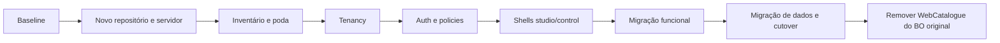

# WebCatalogue — plano faseado de extração do backoffice

Data: 2026-07-25

Estado: **Aprovado**

## Objetivo

Destacar completamente o WebCatalogue do BO agregador sem interromper a operação atual, terminando com:

```text
ar-webcatalogue.com             Frontoffice institucional
studio.ar-webcatalogue.com      BO dos clientes
control.ar-webcatalogue.com     BO administrativo interno
api.ar-webcatalogue.com         Documentação e API
{store}.ar-webcatalogue.com     Catálogo público
```

## Estratégia revista: fork e poda controlada

O BO atual é uma aplicação multi-projeto e já contém a infraestrutura necessária para executar o WebCatalogue. A estratégia passa a ser:

1. criar uma baseline/tag do BO atual;
2. criar um novo repositório Git privado a partir dessa baseline, preservando o histórico;
3. instalar essa cópia num servidor/ambiente final dedicado ao WebCatalogue;
4. validar primeiro uma versão funcionalmente igual à atual;
5. no novo repositório, manter o WebCatalogue e as ferramentas transversais necessárias;
6. remover progressivamente módulos, áreas, dados e menus sem utilidade para o WebCatalogue;
7. construir `studio`, `control`, API e multi-tenancy no novo repositório;
8. migrar os dados WebCatalogue para a nova base de dados;
9. realizar o cutover;
10. remover o WebCatalogue do BO multi-projeto original.

Esta abordagem reduz o trabalho inicial de reconstrução da infraestrutura global. A separação física acontece no início, mas a remoção funcional continua incremental e reversível.

Não copiar o `.env`, secrets, uploads ou a base de dados completa do BO multi-projeto para o novo servidor. Código e histórico podem ser clonados; dados e configuração devem ser migrados de forma seletiva.

## Regras de execução

- nenhuma fase avança sem cumprir o respetivo critério de saída;
- migrations devem ser compatíveis com rollback ou forward-fix documentado;
- durante coexistência, existe uma única origem de verdade;
- não manter dois caminhos de escrita concorrentes sem controlo;
- todas as novas funcionalidades são construídas diretamente na arquitetura autónoma;
- feature flags controlam exposição, escrita e cutover;
- logs identificam origem: `legacy_bo`, `studio`, `control`, `api` ou `public`;
- qualquer acesso cross-tenant é auditado.
- depois do fork, não fazer merges gerais entre os dois repositórios;
- correções realmente partilhadas devem ser portadas por commits identificados/cherry-pick;
- cada repositório deve ter secrets, deploy, storage e base de dados próprios;
- o BO original só perde o WebCatalogue depois do cutover e da janela de rollback.

## Repositórios

### BO multi-projeto atual

Mantém:

- projetos e módulos não relacionados com WebCatalogue;
- ferramentas transversais que continuem necessárias a esses projetos;
- histórico integral anterior à separação.

Remove no final:

- `Modules/WebCatalogue`;
- rotas, menus, permissões e configs exclusivas do WebCatalogue;
- assets e comandos exclusivos;
- jobs/schedules exclusivos;
- variáveis de ambiente exclusivas;
- dados `wc_*`, apenas depois de backup e validação da migração.

### Novo BO WebCatalogue

Parte da baseline do BO atual e mantém inicialmente:

- Laravel e infraestrutura base;
- WebCatalogue;
- autenticação;
- permissões;
- notificações;
- auditoria e logs;
- filas e scheduler;
- gestão de erros;
- ferramentas de sistema/deploy estritamente necessárias.

Remove progressivamente:

- áreas pessoais/familiares;
- investimentos, ERP e gestão documental não necessários;
- módulos de outros produtos;
- menus e dashboards multi-projeto;
- integrações e secrets não usados;
- migrations/seeders/dados alheios;
- uploads e ficheiros privados de outros projetos.

A lista final de módulos a manter/remover será aprovada por inventário antes da poda.

## Feature flags propostas

```text
WEBCATALOGUE_STUDIO_ENABLED
WEBCATALOGUE_CONTROL_ENABLED
WEBCATALOGUE_TENANCY_ENFORCEMENT
WEBCATALOGUE_LEGACY_BO_READ_ONLY
WEBCATALOGUE_LEGACY_BO_ENABLED
WEBCATALOGUE_HOST_ROUTING_ENABLED
WEBCATALOGUE_API_V1_ENABLED
```

As flags devem ter valores por ambiente e não podem ser alteradas por utilizadores sem autorização administrativa.

## Fase 0 — baseline e proteção

### Trabalho

- congelar baseline funcional;
- garantir suite automática verde;
- guardar inventário de rotas, configurações e tabelas;
- backup da base de dados e storage;
- preparar dados de demonstração;
- remover endpoint temporário MTG;
- documentar rollback operacional.

### Critério de saída

- testes verdes;
- backup e restore validados;
- working tree limpo;
- nenhuma rota temporária pública;
- baseline identificada por commit/tag.

### Rollback

Não aplicável: ainda não existe mudança de arquitetura.

## Fase 1 — criar o novo repositório e ambiente

### Trabalho

- criar tag da baseline;
- criar repositório Git privado WebCatalogue preservando histórico;
- configurar remote e branch principal próprios;
- criar servidor/virtual host de staging;
- criar `.env` novo a partir de `.env.example`;
- gerar `APP_KEY`, cookies e secrets próprios;
- criar base de dados e utilizador de base de dados dedicados;
- criar storage dedicado;
- configurar CI/CD, logs, backups e health check;
- instalar uma cópia funcionalmente equivalente antes de remover módulos.

### Critério de saída

- novo repositório acessível;
- deploy reproduzível;
- aplicação responde em staging;
- não existem secrets ou dados de outros projetos;
- WebCatalogue atual funciona no novo ambiente.

### Rollback

O BO original continua inalterado e operacional.

## Fase 2 — inventário e poda do novo BO

### Trabalho

- inventariar todos os módulos, providers, commands, migrations e assets;
- classificar cada componente: manter, substituir, remover ou avaliar;
- mapear dependências transitivas;
- remover uma área de cada vez;
- executar testes, rotas e smoke tests após cada remoção;
- substituir dashboard e navegação multi-projeto por shell WebCatalogue;
- limpar composer/npm/config/env de dependências não usadas.

### Critério de saída

- apenas WebCatalogue e ferramentas aprovadas permanecem;
- nenhuma rota/menu de outros projetos;
- nenhuma dependência quebrada;
- suite e deploy verdes;
- inventário final documentado.

### Rollback

- reverter o commit de poda da área;
- não remover várias áreas independentes no mesmo commit.

## Fase 3 — fundação multi-tenant

### Trabalho

- criar organizações;
- criar memberships de organização e store;
- adicionar `id_organization` às stores;
- criar `TenantContext`;
- criar resolução de tenant para sessão, hostname, API e jobs;
- migrar stores atuais para `Legacy WebCatalogue`;
- executar auditoria de `id_store` nulos ou inválidos;
- adicionar policies em modo de observação.

### Coexistência

O BO antigo continua operacional. O enforcement inicia em modo de auditoria, registando violações sem bloquear.

### Critério de saída

- dados atuais associados a organização;
- testes de isolamento verdes;
- zero ownership órfão;
- logs de auditoria sem violações não explicadas.

### Rollback

- desativar `WEBCATALOGUE_TENANCY_ENFORCEMENT`;
- manter colunas/tabelas novas sem as apagar;
- continuar a usar `id_store` como antes.

## Fase 4 — autenticação e autorização autónomas

### Trabalho

- implementar login, convite, recuperação e verificação de email;
- criar roles e policies aprovadas;
- sessões separadas para `studio` e `control`;
- MFA obrigatório no `control`;
- credenciais API por store;
- auditoria de logins, memberships e ações críticas.

### Coexistência

Utilizadores piloto podem aceder ao `studio`; restantes continuam no BO antigo.

### Critério de saída

- fluxos de auth testados;
- matriz de permissões coberta por testes;
- cookies não cruzam subdomínios;
- MFA e revogação de sessão validados.

### Rollback

- desativar `studio`/`control`;
- manter autenticação antiga;
- não eliminar utilizadores ou mappings durante o piloto.

## Fase 5 — shells studio e control

### Trabalho

- criar layouts e navegação próprios;
- criar controllers base próprios;
- substituir actions, breadcrumbs e page titles globais;
- criar seletor de organização/store;
- criar dashboard inicial;
- separar visualmente o modo de suporte/administração.

### Coexistência

As shells começam com funcionalidades de consulta. Links de escrita apontam temporariamente para o BO antigo quando necessário.

### Critério de saída

- shells funcionam sem `layouts.app`;
- controllers não dependem do controller global;
- navegação respeita roles;
- responsividade e acessibilidade base validadas.

### Rollback

- desligar as flags das shells;
- manter links e rotas legacy.

## Fase 6 — migração funcional para o studio

Migrar na seguinte ordem:

1. dashboard e consulta;
2. stores e configuração;
3. catálogos;
4. produtos;
5. recursos e preços;
6. imports;
7. preview e publicação;
8. reconhecimento e leads;
9. benchmarks;
10. 3D/AR/VR;
11. integrações e sincronização.

Para cada área:

1. implementar leitura no studio;
2. comparar contagens/dados com legacy;
3. implementar escrita;
4. executar testes e auditoria;
5. tornar legacy read-only nessa área;
6. observar;
7. desligar a área legacy.

### Critério de saída

- paridade funcional;
- testes de permissões e tenant;
- zero divergência de dados;
- operação real no studio durante período acordado.

### Rollback

- desativar escrita no studio apenas para a área afetada;
- reativar escrita legacy;
- usar a mesma base de dados, evitando migração reversa de dados.

## Fase 7 — BO control

### Trabalho

- gestão de organizações e stores;
- gestão de utilizadores internos;
- suporte temporário auditado;
- filas, jobs e saúde operacional;
- auditoria global;
- gestão de incidentes e configuração da plataforma;
- sem exposição de secrets existentes.

### Critério de saída

- MFA obrigatório;
- todos os acessos cross-tenant auditados;
- support access limitado por motivo e duração;
- operações críticas testadas.

### Rollback

- limitar `control` a leitura;
- manter ferramentas internas atuais até estabilização.

## Fase 8 — contratos e infraestrutura própria

### Trabalho

- substituir `notifications_send` por contrato;
- isolar storage por organização/store;
- separar filas e scheduler;
- separar cache e sessões;
- registar provider sem ModuleManager;
- declarar autoload de produção;
- mover assets para pipeline próprio;
- configurar secrets e observabilidade.

### Critério de saída

- nenhum runtime crítico depende de outro módulo;
- jobs, notificações e storage operam autonomamente;
- deploy reproduzível em staging.

### Rollback

- adapters continuam capazes de encaminhar para serviços antigos;
- feature flags selecionam implementação antiga/nova durante transição.

## Fase 9 — migração de dados e cutover

### Trabalho

- configurar DNS/TLS wildcard;
- exportar apenas tabelas/dados WebCatalogue e dependências aprovadas;
- migrar utilizadores necessários através de processo controlado;
- sincronizar storage WebCatalogue;
- validar contagens, hashes e ownership;
- configurar host routing;
- ativar landing, studio, control, API e stores;
- redirecionar links antigos;
- tornar todo o BO legacy read-only;
- monitorizar erros, latência, auth e jobs.

### Critério de saída

- todos os domínios funcionam em HTTPS;
- utilizadores operam exclusivamente no studio;
- equipa interna opera no control;
- stores resolvem automaticamente;
- período de observação sem incidente crítico.

### Rollback

- DNS/route flags voltam aos hosts anteriores;
- reativar escrita legacy;
- manter base partilhada durante a janela de rollback.
- se os repositórios já usarem bases separadas, executar sincronização final e voltar temporariamente o tráfego ao BO original.

## Fase 10 — remoção do WebCatalogue no BO antigo

### Trabalho

- remover rotas, menus e configs WebCatalogue do agregador;
- remover módulo, assets, comandos, schedules e variáveis de ambiente exclusivas;
- arquivar/retirar tabelas `wc_*` apenas depois de backup final;
- remover dependência do controller/layout global;
- remover PermissionRoleManager do runtime WebCatalogue;
- remover adapters já sem uso;
- arquivar documentação legacy;
- invalidar acessos e secrets antigos.

### Critério de saída

- nenhuma rota WebCatalogue no BO agregador;
- nenhuma dependência runtime interna não aprovada;
- testes, deploy e restore autónomos;
- documentação atualizada.

### Rollback

Após esta fase o rollback é por versão/deploy, não por feature flag. Só executar após terminar a janela formal de retorno.

## Sequência visual



## Estratégia de dados

- base de dados dedicada no novo ambiente;
- nunca copiar a base multi-projeto completa;
- migrations apenas aditivas nas primeiras fases;
- export seletivo das tabelas `wc_*` e dependências aprovadas;
- sincronização final durante janela de manutenção;
- dual-read apenas para validação, não como arquitetura permanente;
- evitar dual-write;
- até ao cutover, o BO original continua como origem de verdade;
- backups antes de migrations estruturais;
- scripts de auditoria idempotentes;
- foreign keys ativadas depois da limpeza.

## Estratégia de deploy

Ambientes:

```text
local → staging → production
```

Para cada fase:

1. merge e testes;
2. deploy staging;
3. migrations;
4. smoke tests;
5. piloto;
6. decisão go/no-go;
7. deploy production;
8. observação;
9. fecho ou rollback.

## Critérios globais de go/no-go

### Go

- testes automáticos verdes;
- checklist manual concluída;
- backup recente e restore conhecido;
- métricas e logs disponíveis;
- responsável de rollback identificado;
- nenhuma violação tenant;
- nenhuma divergência de dados.

### No-go

- falha de isolamento;
- perda ou duplicação de dados;
- permissões incorretas;
- jobs sem tenant;
- secrets expostos;
- rollback não testado;
- erro crítico sem diagnóstico.

## Decisões propostas para aprovação

- [x] criar o novo repositório a partir da baseline atual, preservando histórico;
- [x] colocar primeiro uma cópia funcional no novo servidor;
- [x] usar base de dados, storage, secrets e deploy próprios;
- [x] não copiar a base de dados multi-projeto completa;
- [x] podar o novo BO módulo a módulo;
- [x] aprovar inventário de ferramentas a manter antes da poda;
- [x] manter o BO atual durante a coexistência;
- [x] manter o BO original como origem de verdade até ao cutover;
- [x] evitar dual-write;
- [x] feature flags e rollback por fase;
- [x] remover WebCatalogue do BO original apenas após cutover e observação;
- [x] portar correções partilhadas por commits selecionados, sem merges gerais.

Estratégia aprovada pelo responsável do projeto em 2026-07-25.

## Destinos aprovados

- Git: GitHub, conta `wlavv`;
- repositório proposto: `wlavv/webcatalogue`, privado;
- servidor de staging/produção: Rise-S;
- baseline: tag `webcatalogue-extraction-baseline-2026-07-25`.

O remote do BO multi-projeto mantém-se inalterado. No clone destinado ao WebCatalogue:

```text
origin  → novo repositório WebCatalogue
legacy  → repositório tools, apenas para consulta/cherry-pick controlado
```

Não enviar `.env`, secrets, uploads ou dumps da base de dados para o GitHub.
