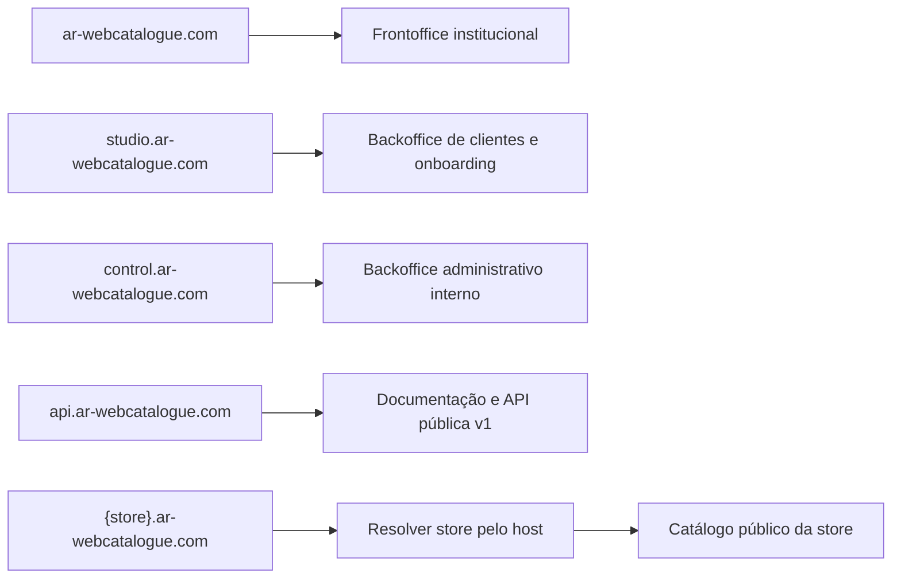

# WebCatalogue — estrutura de domínios

Estado: **Estrutura aprovada**

Data: 2026-07-25

## Domínio principal

`ar-webcatalogue.com`

Uso: frontoffice institucional e comercial do WebCatalogue.

## Subdomínios técnicos reservados

| Endereço | Utilização |
|---|---|
| `studio.ar-webcatalogue.com` | Backoffice dos clientes e onboarding |
| `control.ar-webcatalogue.com` | Backoffice administrativo interno |
| `api.ar-webcatalogue.com` | Documentação e API pública para lojas custom |
| `status.ar-webcatalogue.com` | Estado dos serviços, se for publicado |
| `staging.ar-webcatalogue.com` | Ambiente de validação, com acesso restrito |

Os subdomínios técnicos devem ser reservados para evitar que sejam atribuídos a lojas.

## API e documentação para lojas custom

Endereço público:

```text
https://api.ar-webcatalogue.com
```

Organização proposta:

```text
GET  /                 Documentação/portal do integrador
GET  /openapi.json     Especificação OpenAPI
GET  /health           Estado público mínimo da API
/v1/*                  Endpoints versionados da API
```

A mesma origem serve a documentação e os endpoints. A documentação deve permitir testar pedidos apenas contra uma store sandbox e nunca deve incluir credenciais reais.

Os nomes DNS não distinguem maiúsculas de minúsculas. O endereço canónico usado no código, certificados e documentação será sempre `api.ar-webcatalogue.com`.

## Subdomínio por loja

Formato:

```text
{store_slug}.ar-webcatalogue.com
```

Exemplos:

```text
prestashop.ar-webcatalogue.com
shopify.ar-webcatalogue.com
magento.ar-webcatalogue.com
```

Estes nomes representam lojas concretas. A plataforma de origem da integração deve ser guardada na configuração da store, sem ficar obrigatoriamente acoplada ao seu subdomínio.

## Regras para o slug

- único em toda a plataforma;
- apenas letras minúsculas, números e hífen;
- começar e terminar com letra ou número;
- sem espaços, acentos ou underscore;
- comprimento recomendado entre 3 e 50 caracteres;
- não permitir palavras reservadas;
- manter histórico ou redirecionamento quando o slug for alterado.

## Subdomínios reservados

Lista inicial:

```text
www
app
api
docs
status
staging
admin
auth
login
mail
smtp
cdn
assets
static
files
storage
support
help
demo
test
dev
```

## Infraestrutura necessária

- DNS wildcard `*.ar-webcatalogue.com`;
- certificado TLS para `ar-webcatalogue.com` e `*.ar-webcatalogue.com`, com renovação automática;
- virtual host/reverse proxy que aceite `ar-webcatalogue.com` e qualquer subdomínio de primeiro nível;
- resolução da store através do host, sem aceitar um `store_id` arbitrário do cliente;
- criação automática do endereço público após guardar uma store com slug válido;
- cookies do BO de clientes limitados a `studio.ar-webcatalogue.com`;
- cookies do BO administrativo limitados a `control.ar-webcatalogue.com`;
- CORS da API limitado às origens autorizadas;
- proteção contra apropriação de subdomínios eliminados;
- validação de subdomínios antes da publicação;
- logs e métricas identificados pela store resolvida no servidor.

## Encaminhamento esperado



## Decisões ainda necessárias

- escolher a solução de DNS/TLS e o ambiente de alojamento;
- definir suporte futuro para domínios personalizados das lojas.

## Decisões aprovadas

- `ar-webcatalogue.com` para o frontoffice institucional;
- `studio.ar-webcatalogue.com` para o BO dos clientes;
- `control.ar-webcatalogue.com` para o BO administrativo;
- `api.ar-webcatalogue.com` para documentação e API;
- `{store_slug}.ar-webcatalogue.com` para catálogos públicos;
- criação automática dos endereços das stores através de wildcard DNS/TLS;
- `www.ar-webcatalogue.com` deve redirecionar para `ar-webcatalogue.com`;
- `status` e `staging` ficam reservados.
