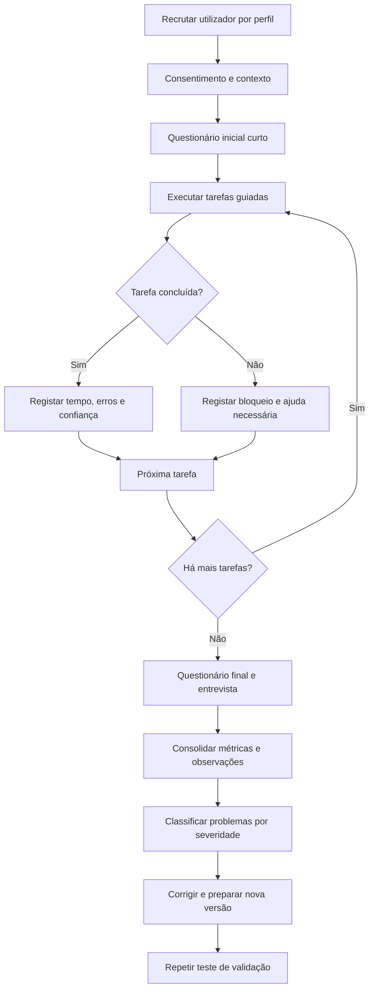

# WebCatalogue — fluxo guiado de testes com utilizadores

## Objetivo

Validar se pessoas representativas conseguem compreender, configurar e utilizar o WebCatalogue com autonomia. O facilitador apresenta o contexto e as tarefas, mas não explica onde clicar nem como concluir cada passo.

## Perfis

1. **Gestor de loja:** configura a presença e acompanha resultados.
2. **Operador de catálogo:** importa, corrige e publica produtos.
3. **Integrador técnico:** liga um e-commerce ou uma store custom.
4. **Visitante:** explora um catálogo e usa o reconhecimento visual.

## Diagrama do processo

## Sessão recomendada

### 1. Preparação

- Usar uma conta, store e dataset próprios para o teste.
- Registar versão, ambiente, browser e dispositivo.
- Pedir autorização explícita antes de gravar ecrã, voz ou imagem.
- Não utilizar dados comerciais ou pessoais reais.

### 2. Introdução

Texto sugerido:

> Estamos a testar a plataforma, não a pessoa. Realize cada tarefa como faria normalmente e diga em voz alta o que espera encontrar. Se ficar bloqueado, pode dizê-lo a qualquer momento.

### 3. Tarefas do gestor/operador

1. Entrar no WebCatalogue e identificar o estado da store.
2. Configurar a identidade visual e informação pública.
3. Importar um pequeno conjunto de produtos.
4. Identificar e corrigir um produto com dados inválidos.
5. Organizar produtos num catálogo.
6. Abrir o preview e publicar.
7. Encontrar o catálogo público como cliente.
8. Consultar o estado de uma sincronização e recuperar um erro.

### 4. Tarefas do integrador

1. Encontrar a documentação de integração adequada.
2. Criar credenciais limitadas a uma store sandbox.
3. Ligar um conector ou autenticar na API.
4. Criar ou atualizar um produto de forma idempotente.
5. Associar media e publicar o produto.
6. Confirmar o resultado por API/webhook e no backoffice.
7. Diagnosticar um erro simulado e revogar as credenciais.

### 5. Tarefas do visitante

1. Explicar, a partir da landing page, o que faz o WebCatalogue.
2. Encontrar uma store e navegar no catálogo.
3. Filtrar e abrir um produto.
4. Consultar imagens, recursos e visualização disponível.
5. Usar o scan/reconhecimento e interpretar o resultado.
6. Reportar um resultado incorreto ou produto não encontrado.

## Métricas por tarefa

- Conclusão: sem ajuda, com ajuda ou não concluída.
- Tempo total.
- Número de erros e regressos.
- Momento e causa do bloqueio.
- Expectativa verbalizada pelo utilizador.
- Facilidade percebida de 1 a 5.
- Confiança no resultado de 1 a 5.

## Severidade dos problemas

- **S0 — crítico:** impede concluir uma tarefa essencial ou causa perda/exposição de dados.
- **S1 — alto:** exige ajuda do facilitador ou conduz frequentemente ao caminho errado.
- **S2 — médio:** causa atraso, dúvida ou erro recuperável.
- **S3 — baixo:** texto, consistência ou melhoria cosmética.

## Critérios iniciais de sucesso do piloto

- Pelo menos 5 utilizadores, cobrindo todos os perfis; aumentar a amostra em ciclos posteriores.
- 100% das tarefas críticas sem erros técnicos bloqueadores.
- Pelo menos 80% de conclusão sem ajuda nos percursos principais.
- Nenhum problema S0 em aberto.
- Problemas S1 corrigidos ou formalmente aceites antes da apresentação.
- Relatório final com métricas, observações, evidência, decisão e responsável.

## Saídas do processo

- Resumo por perfil e tarefa.
- Lista de problemas reproduzíveis.
- Backlog priorizado por severidade e frequência.
- Alterações implementadas e respetivo reteste.
- Limitações conhecidas e recomendações para o ciclo seguinte.
