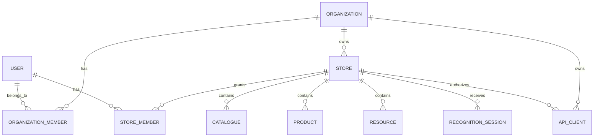

# WebCatalogue — modelo multi-tenant

Data: 2026-07-25

Estado: **Proposta para aprovação**

## Decisão principal proposta

Usar uma base de dados partilhada com isolamento por linha:

```text
Organização → Stores → Catálogos/Produtos/Recursos/Operação
```

Cada registo funcional pertence a uma store através de `id_store`. Cada store pertence obrigatoriamente a uma organização através de `id_organization`.

Esta abordagem é recomendada para o MVP porque:

- aproveita o schema atual;
- reduz custo operacional;
- simplifica migrações e reporting;
- permite a um utilizador trabalhar em várias stores;
- mantém a possibilidade futura de separar clientes enterprise para bases dedicadas.

## Entidades

### Organização

Representa o cliente/empresa titular de uma ou mais stores.

Tabela proposta: `wc_organizations`

Campos essenciais:

- `id`;
- `public_id` ULID/UUID, usado externamente;
- `name`;
- `slug`, único;
- `status`: `trial`, `active`, `suspended`, `closed`;
- `default_locale`;
- `default_currency`;
- `timezone`;
- `settings` JSON;
- timestamps e soft delete.

### Store

A tabela `wc_stores` mantém-se e recebe:

- `id_organization`, obrigatório;
- `public_id` ULID/UUID;
- `slug` globalmente único, porque define `{slug}.ar-webcatalogue.com`;
- `status`;
- `published_at`;
- soft delete.

O slug público não deve ser o identificador interno nem ser aceite como prova de autorização.

### Utilizador

O utilizador é global e pode pertencer a várias organizações.

Para o MVP:

- email globalmente único;
- password própria do WebCatalogue;
- email verificado;
- estado da conta;
- MFA preparado para administradores;
- sem SSO nesta fase.

### Membership da organização

Tabela proposta: `wc_organization_members`

- `id_organization`;
- `id_user`;
- `role`;
- `store_access`: `all` ou `restricted`;
- `status`: `invited`, `active`, `suspended`, `removed`;
- `invited_by`;
- `invited_at`, `accepted_at`;
- timestamps.

Papéis iniciais:

- `owner`: controlo total da organização;
- `admin`: utilizadores, stores e configuração;
- `billing`: faturação futura, sem acesso operacional por defeito;
- `member`: acesso definido por store.

### Membership da store

Tabela proposta: `wc_store_members`

- `id_store`;
- `id_user`;
- `role`;
- `status`;
- `granted_by`;
- timestamps.

Papéis iniciais:

- `manager`: configuração, equipa, integração e publicação;
- `editor`: catálogos, produtos, recursos e preview;
- `reviewer`: reconhecimento, leads e ground truth;
- `integrator`: credenciais, API, conectores e sincronizações;
- `viewer`: consulta sem alterações.

Owners/admins com `store_access=all` não precisam de uma linha por store. Memberships de store são usadas para acessos restritos e overrides explícitos.

### Credenciais de API

Tabela proposta: `wc_api_clients`

- `id_organization`;
- `id_store`;
- `public_id`;
- `name`;
- hash do secret, nunca o secret em claro;
- scopes;
- `last_used_at`;
- `expires_at`;
- `revoked_at`;
- `created_by`;
- timestamps.

As credenciais são sempre limitadas a uma store no MVP.

## Diagrama



## Resolução do tenant

### Catálogo público

```text
{store_slug}.ar-webcatalogue.com
```

1. Validar o hostname.
2. Rejeitar nomes reservados.
3. Resolver uma store ativa pelo slug.
4. Criar `TenantContext` imutável com organização e store.
5. Aplicar o contexto a queries, cache, storage, logs e rate limits.

### BO de clientes

```text
studio.ar-webcatalogue.com
```

1. Autenticar o utilizador.
2. Selecionar organização entre memberships ativas.
3. Selecionar uma store autorizada.
4. Guardar apenas os identificadores selecionados na sessão.
5. Revalidar membership em todos os pedidos.

Um valor guardado na sessão nunca substitui a policy/autorização.

### BO administrativo

```text
control.ar-webcatalogue.com
```

Não usa membership de cliente como bypass implícito. O acesso global exige um papel interno separado e todas as ações cross-tenant ficam auditadas.

### API

```text
api.ar-webcatalogue.com/v1
```

O tenant é derivado da credencial autenticada. Qualquer `store_id` ou slug no payload é validado contra a store da credencial.

### Jobs e scheduler

Cada job transporta explicitamente:

- `organization_id`;
- `store_id`;
- `actor_id`, quando aplicável;
- correlation/request ID.

O job reconstrói `TenantContext` antes de aceder a dados. Jobs sem contexto de tenant são rejeitados, exceto tarefas globais declaradas.

## Regras de isolamento

1. Todas as tabelas funcionais devem ter `id_store` ou uma relação inequívoca até à store.
2. Tabelas globais devem ser explicitamente classificadas.
3. Queries administrativas passam por repositories/services tenant-aware.
4. Policies validam organização, store, membership, papel e ação.
5. Form requests nunca confiam diretamente em `id_store` recebido.
6. Cache keys incluem organização e store.
7. Storage usa prefixo:

```text
organizations/{organization_id}/stores/{store_id}/...
```

8. Logs incluem `organization_id`, `store_id`, actor e correlation ID.
9. Rate limits públicos e API são segmentados por store/credencial.
10. Exports e ficheiros temporários mantêm o mesmo isolamento.

## Proteção em profundidade

Não depender apenas de global scopes Eloquent. Usar em conjunto:

- `TenantContext`;
- query scopes/repositories;
- policies;
- route model binding tenant-aware;
- foreign keys;
- testes de isolamento;
- auditoria;
- revisão explícita de operações do BO `control`.

## Restrições e índices

- `wc_stores.slug` continua globalmente único;
- membership única por organização/utilizador;
- membership única por store/utilizador;
- foreign keys com `restrict` ou `cascade` decidido por entidade;
- índices iniciados por `id_store` nas queries mais frequentes;
- preferir soft delete para organizações, stores e memberships;
- não reutilizar imediatamente slugs de stores eliminadas.

## Migração dos dados atuais

1. Criar uma organização `Legacy WebCatalogue`.
2. Associar todas as stores atuais a essa organização.
3. Criar membership `owner` para o responsável do projeto.
4. Validar que todos os registos com `id_store` apontam para stores existentes.
5. Identificar registos com `id_store = null` e classificá-los como globais ou corrigir ownership.
6. Introduzir foreign keys apenas após limpar inconsistências.
7. Ativar enforcement de tenant em modo de auditoria.
8. Corrigir violações registadas.
9. Ativar enforcement obrigatório.

## Testes obrigatórios

- utilizador de uma organização não consulta outra;
- utilizador com acesso a uma store não consulta outra store da mesma organização;
- alteração de IDs/slug no request não muda o tenant;
- route model binding devolve 404/403 fora do tenant;
- jobs mantêm o tenant original;
- cache não cruza stores;
- ficheiros e exports não cruzam stores;
- credencial API só opera na store atribuída;
- administrador `control` gera evento de auditoria;
- store suspensa deixa de publicar e aceitar operações protegidas.

## Decisões propostas para aprovação

- [ ] base de dados partilhada com isolamento por linha;
- [ ] organização como tenant principal;
- [ ] store como unidade operacional e de publicação;
- [ ] utilizadores podem pertencer a várias organizações e stores;
- [ ] papéis separados entre organização e store;
- [ ] credenciais API limitadas a uma store;
- [ ] slug da store globalmente único;
- [ ] `TenantContext` obrigatório em web, API, jobs, cache e storage;
- [ ] BO `control` com acesso interno separado e auditado;
- [ ] migração inicial através da organização `Legacy WebCatalogue`.
